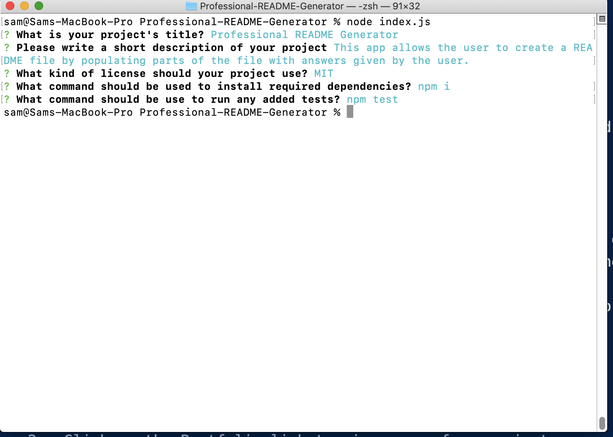

# Professional README Generator 
  
  

---

## Table of Contents
- [About the Project](#About-the-Project)
- [Getting Started](#Getting-Started)
- [Installation](#Installation)
- [Contributing](#Contributing)
- [Testing](#Testing)
- [License](#License) 
- [Demo](#Demo)

## About the Project
This app allows the user to create a README file by populating parts of the file with answers given by the user.

## Getting Started  
To get started, follow the Installation instructions.  

### Installation  
Run the following command in your terminal to install required dependencies:  
npm i

## Testing
If there is a test, run the following command in your terminal:  
npm test

## Contributing
To contribute to this project contact the owner.  
Github Repository URL: https://github.com/samrod777/Professional-README-Generator  

## License
This application is covered under the MIT license.  

## Demo  
https://drive.google.com/file/d/1Y1c5aE19hjVB3x2cPT9YXsh3TsvRHpr2/view
